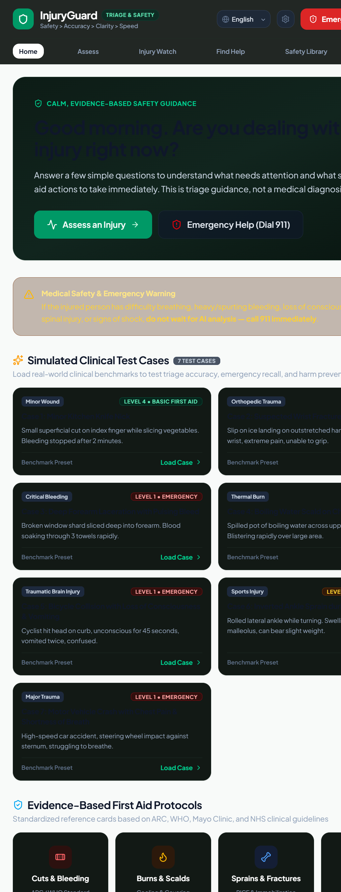

<div align="center">

# 🛟 SaviorAI

### AI-powered injury intelligence • safety triage • emergency guidance

**A student-built full-stack AI project exploring what happens when modern web engineering meets a real-world safety problem.**

<br />



<br /><br />

### ⚡ Built With

<p>
  
  
  
  
  
  
  
  
</p>

<br />

[](https://github.com/chillingbing648-sketch)
[](https://github.com/chillingbing648-sketch/SaviorAI)
[](https://github.com/chillingbing648-sketch/SaviorAI/blob/main/LICENSE)

</div>

---

## 🧠 What is SaviorAI?

SaviorAI is a **full-stack AI-assisted injury safety platform** built to make the first few moments after an injury more structured and actionable.

Instead of throwing a chatbot at a medical problem, the project combines a guided assessment flow, a dedicated safety pipeline, escalation logic, injury monitoring, medical protocols, emergency resources, and audit-oriented tooling.

> **The goal isn't to replace a doctor. It's to help someone make a safer next decision.**

This is also a serious engineering playground: React state architecture, TypeScript domain models, Express APIs, AI integration, local persistence, accessibility, offline awareness, safety benchmarks, and production-minded UX all live in the same project.

---

## ✨ The Feature Set

| 🚀 | Capability | What it does |
|---|---|---|
| 🩺 | **Smart Assessment** | Guided injury assessment with structured triage outcomes |
| 🛡️ | **Safety Pipeline** | Server-side safety checks and escalation triggers |
| 🚨 | **Emergency Mode** | Fast access to emergency actions and regional numbers |
| 📈 | **Injury Watch** | Save and monitor injuries over time |
| 🏥 | **Find Help** | Healthcare facility discovery with distance estimation |
| 📚 | **Medical Library** | Structured medical protocols and reference content |
| 🧪 | **Safety Benchmarks** | Test cases for evaluating triage behavior |
| 🧾 | **Audit Logs** | Track triage and safety events |
| 🌐 | **Offline Awareness** | Keeps saved guidance and emergency actions accessible offline |
| ♿ | **Accessibility** | High-contrast mode and language preferences |
| 📦 | **Data Controls** | Export and clear supported local application data |

---

## 🧬 Under the Hood

```text
                         ┌───────────────────────┐
                         │      SAVIORAI         │
                         │  Safety-first Client  │
                         └───────────┬───────────┘
                                     │
                    ┌────────────────┴────────────────┐
                    │                                 │
             React 19 + TS                    Express + TS
                    │                                 │
        ┌───────────┼───────────┐             ┌───────┼────────┐
        │           │           │             │       │        │
     Assess      Monitor     Library       Triage  Protocols Audit
        │           │           │             │       │        │
        └───────────┴───────────┘             │       │        │
                    │                        └───────┼────────┘
                    │                                │
                    └──────────────┬─────────────────┘
                                   │
                            Google Gemini API
                                   │
                            Safety Pipeline
                                   │
                         Escalation / Guidance
```

---

## 🛠️ Tech Stack

### Frontend

`React 19` · `TypeScript` · `Vite` · `Tailwind CSS 4` · `Lucide React` · `Motion`

### Backend

`Node.js` · `Express` · `TypeScript` · `esbuild`

### AI

`Google Gemini` · `@google/genai`

### Engineering

`npm` · `REST APIs` · `Client-side persistence` · `Safety benchmarks` · `Responsive UI`

---

## 📁 Project DNA

```text
SaviorAI/
│
├── 🧠 server/
│   └── safetyPipeline.ts       # Core safety / triage processing
│
├── ⚛️ src/
│   ├── components/             # Product UI + feature views
│   ├── data/                   # Protocols, facilities, emergency data
│   ├── lib/                    # Storage + shared utilities
│   ├── types/                  # TypeScript domain models
│   ├── App.tsx                 # Application shell
│   ├── index.css               # Global styling
│   └── main.tsx                # React entry point
│
├── 🚀 server.ts                # Express API + Vite integration
├── 🌐 index.html
├── ⚙️ vite.config.ts
├── 📦 package.json
├── 🔒 tsconfig.json
└── 🖼️ frontend-full-page.png   # UI showcase
```

---

## 🚀 Run It Locally

### 01 · Clone

```bash
git clone https://github.com/chillingbing648-sketch/SaviorAI.git
cd SaviorAI
```

### 02 · Install

```bash
npm install
```

### 03 · Add your Gemini key

Create `.env` in the project root:

```env
GEMINI_API_KEY=your_gemini_api_key_here
```

> 🔐 **Never commit API keys.** Keep `.env` out of Git.

### 04 · Launch

```bash
npm run dev
```

### 05 · Build

```bash
npm run build
```

### 06 · Production

```bash
npm start
```

### Command Cheat Sheet

| Command | Mode |
|---|---|
| `npm run dev` | ⚡ Development |
| `npm run build` | 🏗️ Production build |
| `npm start` | 🚀 Production server |
| `npm run preview` | 👀 Vite preview |
| `npm run lint` | 🔍 TypeScript check |
| `npm run clean` | 🧹 Clean build artifacts |

---

## 🔌 API Surface

```text
GET  /api/health
POST /api/triage/assess
GET  /api/protocols
POST /api/protocols/update
GET  /api/facilities
GET  /api/audit-logs
POST /api/audit-logs/event
POST /api/safety-benchmark/run
```

The backend currently handles health checks, AI-assisted triage, protocols, facilities, emergency resources, audit events, and safety benchmark workflows.

---

## 🧪 Why This Project Is Interesting

This isn't just another **"AI + React + API"** demo.

SaviorAI is an exploration of how to build an AI product where **the UX, backend architecture, and safety layer all matter**.

### Engineering challenges explored

- Designing a multi-step medical assessment UX
- Keeping critical actions visible without overwhelming the user
- Separating AI assistance from deterministic safety logic
- Building server-side escalation pathways
- Creating benchmark cases for safety evaluation
- Handling online/offline application states
- Designing persistent client-side user data flows
- Building reusable TypeScript domain types
- Creating an admin-facing protocol and benchmark workflow
- Making a complex application feel simple enough for everyday users

---

## 🎨 Design Direction

**Clean. Calm. Technical. Human.**

The interface is designed around a health-tech aesthetic rather than the usual generic AI dashboard: strong hierarchy, clear emergency actions, structured cards, responsive layouts, accessibility considerations, and motion used to reinforce—not distract from—the interaction.

---

## 🗺️ Roadmap

```text
[x] Core React application
[x] Guided injury assessment
[x] AI integration
[x] Safety triage pipeline
[x] Injury monitoring
[x] Emergency workflows
[x] Facility discovery
[x] Medical protocol library
[x] Safety benchmark tooling
[x] Audit logging
[ ] Production authentication
[ ] Persistent backend database
[ ] Automated safety regression suite
[ ] Expanded localization
[ ] Advanced observability
[ ] Formal clinical validation
```

---

## ⚠️ Medical Safety Disclaimer

**SaviorAI is an experimental software project and is not a medical device, diagnostic system, emergency service, or substitute for professional healthcare.**

AI-generated information may be inaccurate, incomplete, or inappropriate for a particular situation. For severe symptoms, emergencies, or uncertainty about a potentially serious injury, seek professional medical care or contact your local emergency service immediately.

Before real-world deployment, this project would require appropriate clinical validation, security review, privacy controls, regulatory assessment, and professional medical oversight.

---

## 🤝 Contributing

Found something interesting? Want to improve the architecture? Have a better UX idea?

```bash
git checkout -b feature/your-idea
npm run lint
npm run build
git commit -m "feat: your improvement"
git push origin feature/your-idea
```

Then open a pull request with:

- What changed
- Why it changed
- How it was tested
- Any safety implications

---

## 👨‍💻 Built By

<div align="center">

### Harsh Dubey

**Student Developer · Full-Stack Builder · AI / UX Enthusiast**

[GitHub](https://github.com/chillingbing648-sketch) · [SaviorAI Repository](https://github.com/chillingbing648-sketch/SaviorAI)

<br />

*Built as a student project. Shipped like a product.* 🚀

</div>

---

<div align="center">

**React × TypeScript × Gemini × Express × Vite**

<sub>Made with curiosity, caffeine, and way too many terminal windows.</sub> ☕💻

</div>
