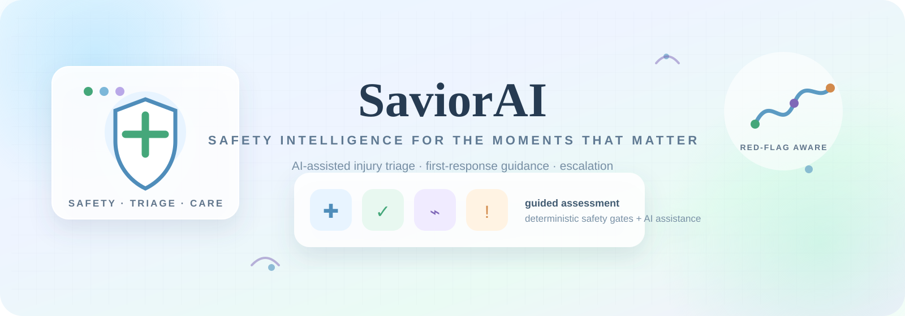

<div align="center">



# 🛟 SaviorAI

### Safety Intelligence for the Moments That Matter.

**AI-assisted injury assessment • deterministic safety gates • emergency escalation • injury monitoring • safety benchmarks**

[](https://chillingbing648-sketch.github.io/SaviorAI/)
[](https://github.com/chillingbing648-sketch/SaviorAI)
[](https://react.dev/)
[](https://www.typescriptlang.org/)
[](https://vite.dev/)
[](https://expressjs.com/)
[](https://ai.google.dev/)

</div>

---

## 🌐 Preview

<div align="center">

<a href="https://chillingbing648-sketch.github.io/SaviorAI/">
  
</a>

**[Open the live frontend →](https://chillingbing648-sketch.github.io/SaviorAI/)**

</div>

---

## 🧭 What Is SaviorAI?

SaviorAI is an experimental full-stack health-tech application that explores how **AI assistance can be combined with deterministic safety engineering** for injury-related guidance.

The application uses a guided assessment flow to collect structured injury information, processes the request through a server-side safety pipeline, uses Google Gemini for AI-assisted reasoning, and applies deterministic escalation and safety checks before presenting guidance.

The project is intentionally designed around one engineering principle:

> **AI can assist reasoning, but it must not be the only safety authority.**

SaviorAI is a software/engineering project and is **not a medical device, diagnostic system, emergency service, or substitute for professional medical care.**

---

## ✨ Core Capabilities

| Capability | Description |
|---|---|
| 🩺 **Guided Assessment** | Step-by-step injury assessment with structured inputs, symptoms, pain and mechanism information. |
| 🛡️ **Safety Pipeline** | Centralized triage processing combining deterministic safety gates, protocol matching and AI assistance. |
| 🚨 **Emergency Escalation** | Red-flag conditions can force an emergency-level result rather than relying on an AI-generated decision. |
| 📈 **Injury Watch** | Save and monitor injuries locally through the current client-side storage layer. |
| 🏥 **Find Help** | Explore the repository's facility dataset and calculate approximate distances from supplied coordinates. |
| 📚 **Medical Library** | Structured protocol and first-response reference content stored in TypeScript data modules. |
| 🧪 **Safety Benchmarks** | Execute predefined cases and measure emergency recall plus unsafe-advice checks. |
| 🧾 **Audit Events** | Record triage and safety events for engineering inspection. |
| 🌐 **Localization** | Language-aware UI support through the translation layer. |
| ♿ **Accessibility-aware UI** | Reusable interface primitives and accessibility-conscious interaction patterns. |
| 🎛️ **Safety/Admin Views** | Engineering views for protocol management and benchmark inspection. |

---

## 🧠 Safety-First Architecture

```text
┌───────────────────────────────┐
│          React Client         │
│                               │
│ Assessment · Injury Watch     │
│ Emergency · Library · Help    │
└───────────────┬───────────────┘
                │
                ▼
┌───────────────────────────────┐
│          Express API          │
└───────────────┬───────────────┘
                │
                ▼
┌────────────────────────────────────────┐
│         Safety Triage Pipeline          │
│                                        │
│  Structured input                       │
│       ↓                                │
│  Deterministic safety / red flags       │
│       ↓                                │
│  Protocol matching                      │
│       ↓                                │
│  Gemini-assisted reasoning              │
│       ↓                                │
│  Safety validation / escalation         │
│       ↓                                │
│  Final triage guidance                  │
└──────────────────┬─────────────────────┘
                   │
          ┌────────┴────────┐
          ▼                 ▼
    Audit event        User guidance
```

### Why this matters

A generic AI application can simply send a prompt to a model and display the answer. SaviorAI takes a different approach: **deterministic rules sit around the model as a safety boundary**.

For example, when the safety pipeline detects a critical red flag, the application can escalate to an emergency-level outcome even if an AI response suggests otherwise.

This makes the safety layer the controlling boundary rather than treating the model as an unrestricted decision-maker.

---

## 🧱 Current Architecture

The repository is currently a compact full-stack TypeScript application rather than a fully separated production monorepo.

### Frontend

```text
src/
├── App.tsx
├── main.tsx
├── index.css
├── components/
│   ├── AssessWizard.tsx
│   ├── EmergencyModal.tsx
│   ├── FindHelpView.tsx
│   ├── InjuryWatchView.tsx
│   ├── LibraryView.tsx
│   ├── MedicalReportModal.tsx
│   ├── AdminSafetyBenchmarkView.tsx
│   ├── Header.tsx
│   ├── HomeView.tsx
│   ├── SettingsView.tsx
│   └── ui/
├── data/
│   ├── emergencyNumbers.ts
│   ├── facilities.ts
│   └── protocols.ts
├── lib/
│   ├── storage.ts
│   └── translations.ts
└── types/
```

### Backend

```text
server.ts
server/
└── safetyPipeline.ts
```

`server.ts` currently provides the Express API, Vite integration and production static serving. `server/safetyPipeline.ts` contains the main safety/triage processing path.

> **Architecture direction:** the next major refactor should split the large safety pipeline into smaller domain modules such as `redFlagEngine`, `triageEngine`, `protocolEngine`, `aiEngine`, `safetyValidator` and `escalationEngine`.

---

## 🔌 API Surface

The current server exposes the following routes:

| Method | Endpoint | Purpose |
|---|---|---|
| `GET` | `/api/health` | Service health and pipeline metadata |
| `POST` | `/api/triage/assess` | Run an injury assessment through the safety pipeline |
| `GET` | `/api/protocols` | Return the active protocol dataset |
| `POST` | `/api/protocols/update` | Create/update a protocol in the current in-memory store |
| `GET` | `/api/facilities` | Return facilities, emergency numbers and optional distance calculations |
| `GET` | `/api/audit-logs` | Return current audit events |
| `POST` | `/api/audit-logs/event` | Record a custom audit event |
| `POST` | `/api/safety-benchmark/run` | Execute the predefined safety benchmark cases |

### Important API limitation

The current API is an MVP implementation. Audit logs and protocol updates are stored **in memory**, so they are not durable across server restarts. Authentication and role-based authorization are also not yet implemented.

The `/api/protocols/update` and audit endpoints therefore require hardening before they should be exposed as production administrative APIs.

---

## 🧪 Safety Benchmarking

SaviorAI includes a benchmark runner designed to test safety behavior rather than only application functionality.

The current benchmark evaluates:

- Emergency-case matching
- Emergency recall
- Red-flag detection
- Explicitly prohibited advice patterns
- Case execution time
- Case-level pass/fail status

Conceptually:

```text
Benchmark Case
      ↓
Assessment Input
      ↓
Safety Pipeline
      ↓
Expected vs Actual
      ↓
Safety Checks
      ↓
Benchmark Report
```

### Benchmark philosophy

A future production-grade benchmark should expand beyond the current demo cases to include:

- Paraphrased emergency descriptions
- Adversarial wording
- Contradictory symptoms
- Missing information
- False-positive analysis
- False-negative analysis
- Protocol adherence
- AI consistency
- Unsafe recommendation detection
- Regression comparisons between releases

**Benchmark results are engineering signals, not clinical validation.**

---

## 🛠️ Technology Stack

### Frontend

- React 19
- TypeScript 5.8
- Vite 6
- Tailwind CSS 4
- Lucide React
- Motion

### Backend

- Node.js
- Express 4
- TypeScript
- esbuild
- dotenv

### AI

- Google Gemini
- `@google/genai`

### Engineering & Deployment

- npm
- Git / GitHub
- GitHub Actions
- Render deployment hook
- GitHub Pages frontend preview
- Client-side local storage

---

## 📦 Installation

### Requirements

- Node.js 20 recommended
- npm
- A Gemini API key for AI-assisted features

### 1. Clone the repository

```bash
git clone https://github.com/chillingbing648-sketch/SaviorAI.git
cd SaviorAI
```

### 2. Install dependencies

```bash
npm install
```

### 3. Configure environment variables

Create `.env` in the project root:

```env
GEMINI_API_KEY=your_gemini_api_key_here
```

Never commit `.env` or API credentials.

### 4. Start development

```bash
npm run dev
```

The Express/Vite development server listens on port `3000`.

### 5. Create a production build

```bash
npm run build
```

### 6. Start the production server

```bash
npm start
```

---

## 📜 Available Scripts

| Command | Purpose |
|---|---|
| `npm run dev` | Start the TypeScript Express/Vite development server |
| `npm run build` | Build the Vite frontend and bundle `server.ts` with esbuild |
| `npm start` | Start the bundled production server |
| `npm run preview` | Preview the Vite frontend build |
| `npm run lint` | Run TypeScript validation (`tsc --noEmit`) |
| `npm run clean` | Remove generated build output on Unix-like environments |

---

## 🔄 CI/CD

The repository contains a GitHub Actions workflow at `.github/workflows/main.yml`.

Current flow:

```text
Push / Pull Request to main
          ↓
       npm ci
          ↓
 TypeScript validation
          ↓
     Production build
          ↓
 Verify dist/index.html
 Verify dist/server.cjs
          ↓
 Push to main only
          ↓
 Render deploy hook
```

### Recommended CI evolution

```text
Pull Request
     ↓
Typecheck + Lint
     ↓
Unit Tests
     ↓
Safety Regression Tests
     ↓
Security Audit
     ↓
Production Build
     ↓
E2E / Smoke Tests
     ↓
Staging
     ↓
Production
```

For a safety-sensitive application, **failed safety tests should block deployment**.

---

## 🔐 Security & Production Readiness

The current repository is best treated as an **MVP / active development project**.

Before production use, the following areas should be implemented:

### Authentication & authorization

- User authentication
- Admin authentication
- RBAC such as `USER`, `ADMIN`, `SAFETY_REVIEWER`
- Server-side authorization on administrative endpoints

### API hardening

- Request schema validation
- Rate limiting
- CORS policy
- Security headers / CSP
- Request-size limits appropriate to each endpoint
- Sanitized production errors
- Abuse protection

### Data architecture

Replace in-memory server stores with a persistent database such as PostgreSQL.

Suggested entities:

```text
users
assessments
triage_results
injuries
injury_events
audit_events
protocols
protocol_versions
safety_benchmarks
```

### Observability

Add structured logs and identifiers such as:

```text
requestId
assessmentId
decisionId
aiRequestId
```

Monitor API errors, latency, AI latency, emergency escalations, safety overrides and benchmark regressions.

---

## 🗺️ Roadmap

### Phase 1 — Foundation

- [x] React + TypeScript frontend
- [x] Express + TypeScript backend
- [x] Guided assessment
- [x] Safety pipeline
- [x] Gemini integration
- [x] Emergency flow
- [x] Injury Watch
- [x] Protocol library
- [x] Facility discovery
- [x] Audit events
- [x] Safety benchmark runner
- [x] GitHub Actions build validation

### Phase 2 — Safety Engineering

- [ ] Split `safetyPipeline.ts` into focused safety modules
- [ ] Structured symptom normalization
- [ ] Dedicated red-flag engine
- [ ] Dedicated triage engine
- [ ] Dedicated safety validator
- [ ] Expanded adversarial benchmark suite
- [ ] Automated safety regression tests

### Phase 3 — Production Backend

- [ ] Persistent PostgreSQL database
- [ ] Repository/data-access layer
- [ ] Authentication
- [ ] RBAC
- [ ] API validation
- [ ] Rate limiting
- [ ] Security headers
- [ ] Production-safe error handling

### Phase 4 — Reliability

- [ ] Unit test suite
- [ ] Integration/API tests
- [ ] Playwright E2E tests
- [ ] CI safety gates
- [ ] Security/dependency scanning
- [ ] Structured observability
- [ ] Staging environment
- [ ] Production smoke tests

### Phase 5 — Product Quality

- [ ] Deeper accessibility audit
- [ ] Expanded localization
- [ ] Better offline/PWA behavior
- [ ] Real facility/location provider integration
- [ ] Performance optimization
- [ ] Privacy/data controls
- [ ] Clinical review before any real-world medical deployment

---

## 📊 Current Engineering Status

| Area | Status |
|---|:---:|
| Frontend foundation | 🟢 |
| Guided assessment | 🟢 |
| Safety pipeline | 🟢 MVP |
| Gemini integration | 🟢 |
| Emergency workflow | 🟢 |
| Injury monitoring | 🟢 MVP |
| Protocol library | 🟢 |
| Facility dataset | 🟡 Sample / approximate |
| Audit logging | 🟡 In-memory |
| Safety benchmarks | 🟢 MVP |
| Authentication | 🔴 Not implemented |
| RBAC | 🔴 Not implemented |
| Persistent database | 🔴 Not implemented |
| Automated regression suite | 🟡 Planned |
| Production observability | 🟡 Planned |
| Formal clinical validation | ⚪ Not performed |

**Project stage: MVP / Active Development**

---

## 🤝 Development Workflow

When contributing changes, use small, focused branches:

```text
main
 │
 ├── feature/safety-engine
 ├── feature/auth
 ├── feature/database
 ├── test/safety-benchmarks
 └── chore/ci-hardening
```

Recommended workflow:

```text
Create branch
    ↓
Implement one focused change
    ↓
Run typecheck
    ↓
Run tests / safety benchmarks
    ↓
Build production bundle
    ↓
Review diff
    ↓
Open Pull Request
    ↓
CI validation
    ↓
Merge
```

Avoid mixing major refactors, UI redesigns and safety-rule changes in one commit.

---

## ⚠️ Medical & Safety Disclaimer

SaviorAI is an experimental software project created for education, engineering research and product prototyping. It does not provide a medical diagnosis and should not be relied upon as a substitute for a qualified healthcare professional or emergency service.

If a real person may be experiencing a medical emergency, contact the appropriate local emergency service or seek professional medical care immediately.

---

## 👨‍💻 Project

**SaviorAI** — Safety Intelligence for the Moments That Matter.

Repository: https://github.com/chillingbing648-sketch/SaviorAI

Live frontend: https://chillingbing648-sketch.github.io/SaviorAI/

Built with React, TypeScript, Express and Google Gemini.

---

## 🔄 Rebrand Notice

> **SaviorAI is becoming Mendly.**

The project name has been changed to **Mendly**, and the repository/app are currently being reworked under the new identity. The upcoming updates will cover the **name, branding, UI, documentation and related project references**.

These changes will be rolled out over the **next few days** as the transition is completed.

Until then, some parts of the repository may still reference **SaviorAI** while the rebrand is in progress.
